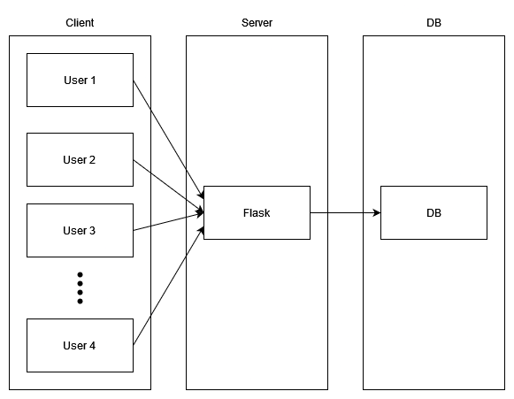

# AEBOLIS

## Description

**AEBOLIS** is short for **AEgis BOok LendIng System**. Aegis is the central club of Dankook University. And purpose of this system is to creating a book lending management system.

## Run

### Dockerfile

```Shell
git clone https://github.com/random6-xyz/AEBOLIS.git ./aebolis
cd ./aebolis/docker
docker build . -t aebolis
docker run aebolis
```

### Local

```Shell
git clone https://github.com/random6-xyz/AEBOLIS.git ./aebolis
cd ./aebolis
python3 run.py
```

## Demo


## Architecture



## Tables


